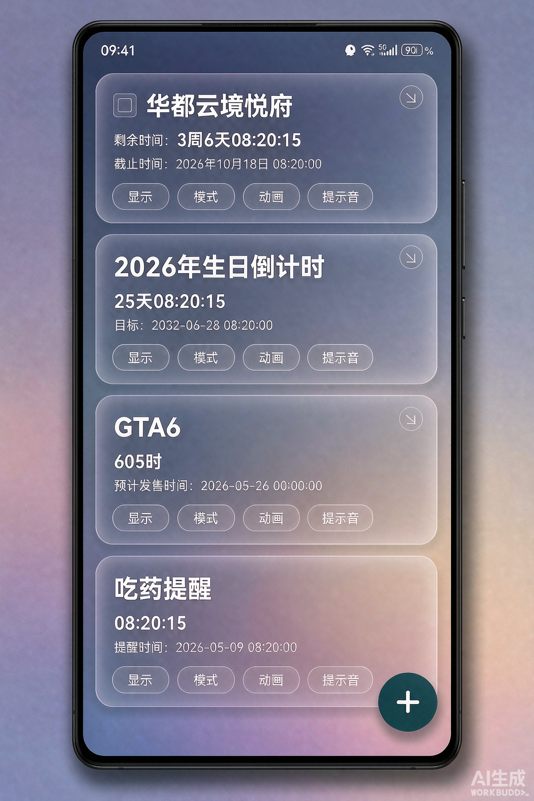
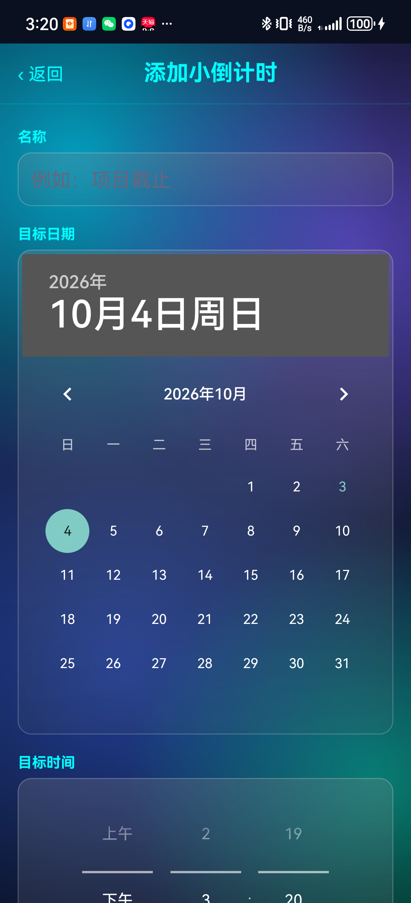
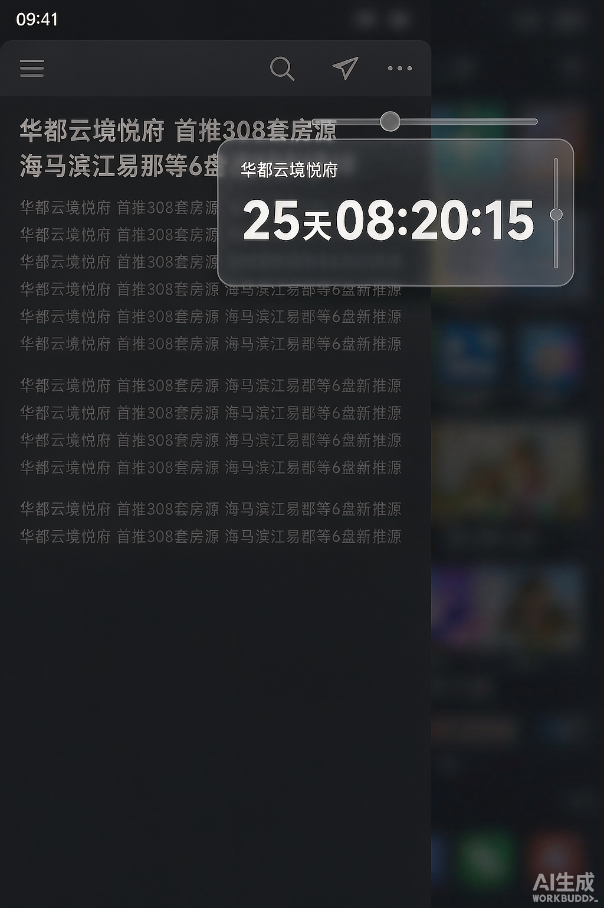
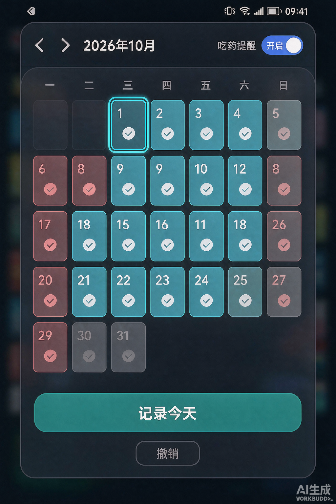

<div align="center">

# 🌐 Language / 语言切换

| 🇨🇳 [简体中文](README.md) | 🇬🇧 [English](README_EN.md) |
|:---:|:---:|
| The same docs in Simplified Chinese | **Current page · English** |

</div>

---

# Countdown (Android Version)

A lightweight, ad-free Android countdown tool written in native Kotlin.
Once a countdown is added you can see it on the main screen, or let it float on top of other apps
so you only need to glance at it to check how much time is left.

> This file is the **English version** (README_EN.md). Tap **🇨🇳 简体中文** in the table above to
> switch to the Chinese version, and tap **🇬🇧 English** to come back.
> *This app is currently available in Simplified Chinese only — there is no English or other
> language version yet. Thank you for your understanding!*

---

## Screenshots

| Main list | Add / Edit countdown |
|---|---|
|  |  |

| Floating window | Medicine calendar |
|---|---|
|  |  |

- Main list: every countdown is a glass card — the remaining time sits right under the title, and
  the button row is always 显示 → 模式 → 动画 → 提示音 (Display → Mode → Animation → Sound)
- Floating window: translucent, floats above other apps; drag it around and adjust its opacity, and
  its seconds tick in sync with the list
- Medicine calendar: solid cyan = dose taken, light red = missed, cyan outline = today

---

## Features

### Countdown management

- **Free add / edit / delete**: title, target date-time and note are all editable
- **8 display modes** (cycle through them with the 「模式」 Mode button on a card; the mode always
  outputs the unit you picked — the format never changes automatically with the remaining time):

  | Mode | Example |
  |---|---|
  | Standard | 3周5天08:20:15 |
  | Hours | 605时 |
  | Minutes | 36320分 |
  | Seconds | 2179215秒 |
  | Days | 25天 |
  | Hours : Minutes : Seconds | 08:20:15 |
  | Days Hours Minutes Seconds | 25天08:20:15 |
  | Days Hours Minutes | 25天08:20 |

- **8 tick animations** (cycle with the 「动画」 Animation button): none / zoom / evaporate / fall /
  pixelate / shatter / burn / shockwave — the animation only affects the **last digit**, and only
  plays when that digit actually changes
- **Per-countdown sound**: tap the sound name on a card to open the system ringtone picker
- **Theme color**: can be set per countdown
- **Long-press a card, drag up / down = reorder**; the order is saved as soon as you let go
  Long-press and then **release in place = enter multi-select delete**; a dragged built-in item
  keeps your custom order separately, without overwriting the factory order
- **Swipe a card left** to reveal 「编辑 / 删除」 (Edit / Delete); swiping right, or cancelling the
  confirmation dialog, slides it back into place automatically

### Floating window

- Show / hide each countdown in the floating window individually
- Drag to move it, tap the title bar to shrink it into a small bar, adjust opacity (20%–100%)
- **Second-by-second sync**: all countdowns share one time base and tick together at the same instant
- Known limitation: while the system 「设置」 Settings screen is in the foreground the floating window
  is temporarily hidden by Android's security enforcement, and comes back automatically when you
  return; if it never shows on any screen, enable 「显示在其他应用上层」 Draw over other apps in
  system settings, and also allow background pop-up in the manufacturer's permission manager

### Daily medicine reminder

- A system notification pops up at **09:00** by default, and you can tap 「**已吃药**」 Taken right on
  the notification to record the day
- The reminder time is changeable any time: open 「关于」 About → 「**提醒时间**」 Reminder time and pick a moment
- Tap 「**吃药提醒：已开启 / 已关闭**」 in About to turn the whole feature off in one tap; once off it
  stops reminding, but already recorded dates are kept
- **Medicine calendar**: see which days were taken and which were missed — solid cyan = taken,
  light red = missed, cyan outline = today; future days cannot be recorded
  - Use the ‹ › arrows on top to change month; the bottom buttons record / undo today in one tap
  - Tap a past or today's cell to back-fill or undo a record
- **It keeps reminding after you exit / close the app** (four layers of protection):
  - ① System alarm clock (`setAlarmClock`): highest priority, survives battery saver (Doze) and
    needs no exact-alarm permission
  - ② Exact alarm (`setExactAndAllowWhileIdle`): a second alarm mounted at the same moment, so it
    still fires inside a Doze maintenance window
  - ③ Daily repeating alarm: a fallback in case the system or the ROM cleared the main route; early
    or late triggers never double-notify
  - ④ **Two extra pings after the due time — at +2 minutes and +30 minutes**: catches the case where
    the main route got deferred or cleared
  - ⑤ Background inspection (`JobScheduler`, every 15 minutes, restores itself after a reboot, plus a
    second entry point): if the alarm has disappeared it remounts it; if today's due moment already
    passed with no notification sent it **sends a catch-up notice** (titled 「补发提醒」)
- **The next reminder time can also be changed**: tap 「**下次提醒**」 in About (the button itself
  shows the current time) and specify a concrete year / month / day + time — e.g. if you missed
  09:00 today, move this one to tonight at 20:30. Only the upcoming occurrence changes; after it
  fires the daily fixed time comes back automatically, and you can hit 「恢复常规」 Reset in the field.
  A manually moved occurrence **always fires** (it is exempt from the "one reminder per day /
  already recorded" de-duplication)
- One reminder per day at most; after you tapped 「已吃药」 the day stays quiet
- **Moving 「下次提醒」 pops up a guide** that can take you straight to 「允许后台运行」 Allow background
  activity (battery optimization off); coming back to the foreground also fires any missed reminder
- If nothing arrives, check 「后台自检」 Background self-check on the About page: it lists the next
  reminder time, the alarm mount time, the **last time a reminder was actually sent**, notification
  permission, exact-alarm permission and battery-optimization state — enough to tell "never sent"
  apart from "sent but blocked by the system"

### Built-in countdowns

Seven come built in: **daily, hourly, every half hour, weekly, monthly, 华都云境悦府
(Huadu Yunjiang Yuefu, 2026-10-31 00:00:00), GTA6 (2026-11-19 08:00:00)**

- Rolling types (daily / weekly / monthly) recompute their target every day, week or month;
  fixed types stop at 0 when due and never roll into the next cycle
- The weekly countdown targets the **next Monday 00:00:00**, i.e. the moment this week ends
  (Monday is the first day of the week)
- Built-in entries **can be deleted and edited**, and they **always stay built-in** — editing the
  target time does not demote them to a normal countdown
- Deleting stores a **settings snapshot**, so restoring via 「恢复内置」 Restore built-ins from the 「＋」 menu
  brings back that entry's theme color, display mode, animation, sound, floating-window setting and
  note as they were, and only recomputes the target time
- When all seven built-in entries are back in the list, the 「恢复内置」 menu item hides itself

#### Display modes of built-in countdowns

Because the cycles differ, "standard mode" shows something different for each built-in entry
(all other modes behave identically for every countdown):

| Built-in entry | Cycle | Standard mode |
| --- | --- | --- |
| Daily | ≤ 24 hours | **xx时xx分xx秒** (weeks / days are always 0) |
| Weekly | ≤ 7 days | **xx天xx时xx分xx秒** (weeks are always 0) |
| Monthly, 华都云境悦府, GTA6 | Long cycle | xx周xx天xx时xx分xx秒 (same as a normal countdown) |

Also, the **daily countdown has no 「天数模式」 Days mode** (it would always show 0 days) — it no
longer appears in the list, the floating window or the editor, and older data that somehow used it
falls back to standard mode automatically.

### Updates and notifications

- Opening the app checks GitHub for a new version automatically; when one exists the update prompt
  shows up and 「立即更新」 Download & install fetches and launches the install inside the app
  - The prompt is a **standalone page** (transparent background + a glass card in the same style as
    the dialog), **not** a system dialog: tools like 「跳过开屏广告 / 弹窗拦截 / 广告过滤」 watch dialog
    windows and will dismiss an update prompt as if it were an ad. Turning it into a normal page and
    deferring it by 800 ms keeps it from being hurt; the download progress shows on the same card
- Two background check routes: `JobScheduler` (network required, every 15 minutes, restores after
  reboot) + an `AlarmManager` fallback (every 2 hours, retry after 30 minutes on failure)
- The About page offers three notification self-check entries: enable notifications / test
  notification / allow background activity (battery optimization off), and shows the background
  check state

---

### If notifications don't arrive

Missing notifications after you exit or close the app — medicine reminders and update notices both
count — is almost never a scheduling problem; it is almost always **the last step getting blocked by
the system**: permission not granted, the notification channel downgraded, or background execution
restricted. All three look identical: the code runs, nothing errors, and nothing shows up.

So start with 「**通知体检**」 Notification checkup on the About page — it walks the gates one by one,
just follow it top to bottom:

- **The bottom primary button names the first thing to fix** — whichever item is not a checkmark, the
  button reads 「**去修第 N 项**」 Fix item N and jumps straight to that setting
- Every row also has its own shortcut button, numbered the same way (「第 N 项·去打开」), so you never
  have to count lines
- **When everything is fine no 「去修」 button is shown**, only a centered 「关闭」 Close
- The numbers are generated from the actual item count (different Android versions check different
  numbers — e.g. below Android 13 there is no "notification permission" item), so they never lines
  up on a fixed list

| Check | What breaks when it fails |
| --- | --- |
| Master notification switch | No notification ever shows |
| Notification permission (Android 13+) | The notification is skipped outright, not even a log line |
| Medicine reminder channel | Demoted to silent notifications or disabled → silently dropped |
| Update channel | Same as above |
| Exact alarm | The trigger may drift (a system alarm + repeating alarm + inspection cover this) |
| Battery optimization | The app is frozen in the background and nothing sends the notification |
| Background activity restriction | The app barely runs in the background |
| Background inspection | Nothing ran for over 3 hours → the trigger chain is broken |

Hardening done on the app side:

- **Notification channels were replaced and raised to the highest level** (they still ring under Do
  Not Disturb and are visible on the lock screen). Once a channel's importance is set the system will
  not let you change it in place, so a disabled channel is now **deleted and recreated
  automatically** instead of being a dead end
- **Medicine reminders use a full-screen alert**: on screen-off / lock screen the medicine page pops
  right in front of you
- **More moments auto-remount the alarm**: boot, over-the-air update (alarms get cleared by
  upgrading), unlock, time change, timezone change and day rollover
- If it notices a notification is blocked when the app opens, it **prompts once** (at most once a
  day, three times in total)

### How soon you get notified about a new version

The app has no push server of its own; it can only **ask GitHub periodically** whether a new version
exists, so "the instant it is published" is not possible. What it does today:

- Background check interval **20 minutes** (plus one system-scheduled route every 15 minutes); a
  first check **1 minute** after boot / unlock / upgrade
- A check immediately every time the app is opened
- While the screen is off (Doze) the system pushes checks later — that is Android's battery-saver
  behaviour and applies to every app

### If an ad-blocking tool closes the update prompt

Tools like 「跳过开屏广告 / 弹窗拦截 / 广告过滤」 rely on an **accessibility service watching the window**,
and dismiss anything that looks like a popup. They cannot block **notification-bar notifications**,
so the About page adds a 「**更新提示**」 Update prompt button with three modes:

| Mode | Behaviour |
| --- | --- |
| Automatic | When a non-system / non-keyboard accessibility service is running, it automatically switches to notification-only |
| Popup | Always show the update prompt page (may be dismissed by those tools) |
| Notification only | Never pop any screen; send just one notification (hardest to block) |

Also, the prompt's deferral was raised from 800 ms to 1.5 s to further avoid the "pops up right when
the app opens" signature used by those blockers. Tapping the notification or pressing
「检查更新」 Check for update manually still opens the prompt page directly — that is the user asking
for it, so it is not downgraded.

## UI reference

| Where | What to do |
|---|---|
| Main list | Each card: title, target time, remaining time, button row (显示 → 模式 → 动画 → sound name) |
| Swipe a card left | Reveals 「编辑 / 删除」 Edit / Delete; swiping right or cancelling the dialog slides it back |
| Long-press and drag a card | Drag up / down to reorder; saved on release |
| Long-press then release in place | Enter "multi-select delete": tick items, then finish to remove |
  The multi-select bar also carries **"Select all" / "Deselect all"**: one tap
  ticks every countdown at once, the other clears them all and leaves multi-select.
| "Select all" in the bar | Tick every countdown at once; "Deselect all" clears |

| 「＋」 bottom-right | Fans out: Add countdown / About / Restore built-ins (only shown when something is missing) |
| About page | Check for update / **说明** Help / Changelog / Enable notifications / Test notification / Allow background activity / **更新提示方式** Update prompt mode / **通知体检** Notification checkup |
| About · Medicine reminder | Toggle (on / off) · Reminder time (daily) · Next reminder (once) · Medicine calendar · Test reminder · Background self-check |

---

## Download & install

Download the latest APK from Releases and install it directly (you need to allow
「安装未知应用」 Install unknown apps):

<https://github.com/baigao110/countdown-android/releases/latest>

Version info inside the app comes from `update.json` in the repository root (versionCode, download
URL and update notes).

---

## Project layout

```
CountdownAndroid/
├─ app/src/main/java/com/baigao/countdown/
│  ├─ MainActivity.kt           Main screen: list, drag ordering, floating-window toggle, restore dialog
│  ├─ Countdown.kt              Data model, display modes (MODE_NAMES), built-in types (BuiltIn), time formatting
│  ├─ CountdownStore.kt         Local storage: save / load (parse / toJson shared by disk and snapshots)
│  ├─ AddEditActivity.kt        Add / edit page
│  ├─ CountdownService.kt       Foreground service that keeps the floating window alive
│  ├─ FloatingView.kt           Floating window view and interaction (drag, collapse, opacity)
│  ├─ CountdownAnimator.kt      8 tick animations
│  ├─ SoundPlayer.kt / SoundNames.kt  Sound playback and name lookup
│  ├─ GlassBackdrop.kt          Liquid-glass backdrop (RenderEffect blur on Android 12+)
│  ├─ UpdateManager.kt          Version check, download & install, changelog, styled dialogs, help
│  ├─ UpdateNotifier.kt         Update notification channel and sending
│  ├─ UpdateCheckJobService.kt  JobScheduler background check
│  ├─ UpdateCheckReceiver.kt    AlarmManager background check (fallback)
│  ├─ MedicineReminder.kt       Medicine reminder: toggle / time / records / alarms / notifications
│  ├─ MedicineAlarmReceiver.kt  Medicine alarm: sends the notification when due, records on 「已吃药」
│  ├─ MedicineCheckJobService.kt  Background inspection: remount alarms, fire missed reminders
│  ├─ MedicineCalendarActivity.kt  Medicine calendar (month view of taken / missed, back-fillable)
│  └─ AboutActivity.kt          About page
├─ app/src/main/res/            Layouts, drawables (glass_* glass texture), themes
├─ update.json                  Version info (used by the in-app update check)
└─ build_apk.bat                Build and sign script
```

---

## Build

You need JDK 17 + Gradle 8.2 + Android SDK 34 (this repository ships no Gradle Wrapper — it uses the
local toolchain).

```bat
cd CountdownAndroid
build_apk.bat
```

Output: `countdown-android-v1.0.0.x-release.apk` (already zip-aligned and signed with
`countdown-release.jks`).

> Note: if the project path contains non-ASCII characters, keep `android.overridePathCheck=true`
> in `gradle.properties`.

---

## Release checklist

1. `app/build.gradle`: bump `versionCode`, set `versionName`
2. `UpdateManager.kt`: update `CURRENT_VERSION_NAME` and prepend a `CHANGELOG` entry
3. `update.json`: versionCode / versionName / date / apkUrl / htmlUrl / note
4. `build_apk.bat`: keep the old version strings in sync
5. Build → spot-check the APK → sync to GitHub → re-read from the API to verify
6. PATCH the GitHub Release with both **name** (`倒计时安卓版 v1.0.0.38（vXX）`, where vXX is the new
   versionCode) and **body** (the `note` from `update.json`)

The version number supports four segments, `versionToNumber = major*1e6 + minor*1e4 + patch*100 + build`;
**`versionCode` must increase**, and confirm `/releases/latest` points at the new build after publishing.

---

---

`Countdown (Android) BY baigao110`

> 中文版见 [README.md](README.md) —— 可点上面的「简体中文」切回中文版。
